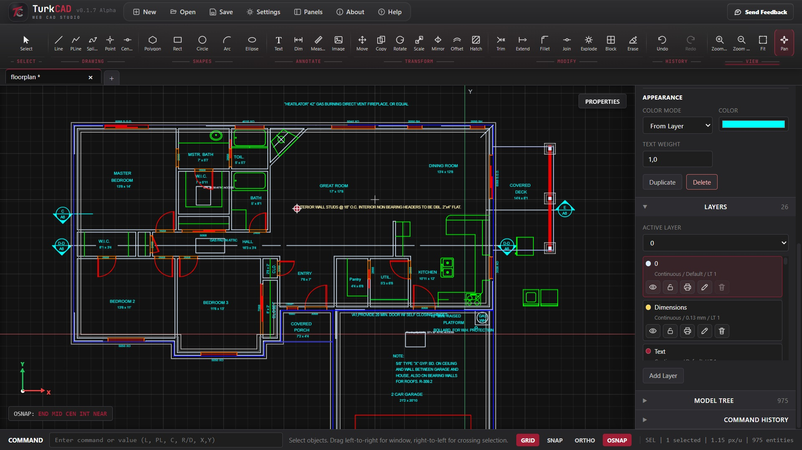
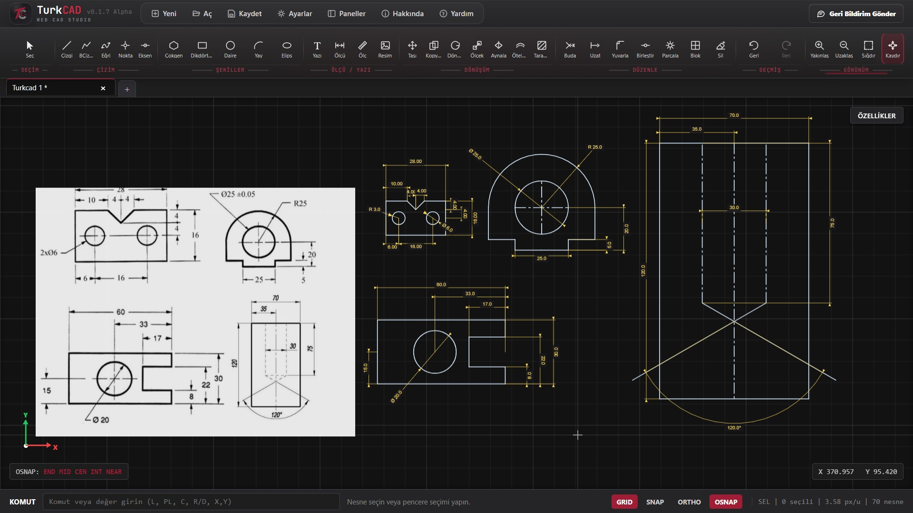
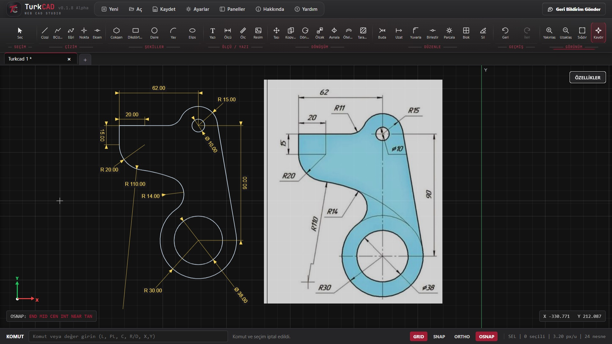

  <strong>English</strong> |
  <a href="README_tr.md">Türkçe</a>

# TurkCAD Web CAD Studio

  

  <strong>Open-source, browser-based 2D CAD workspace for lightweight drafting, DXF workflows, dimensions and technical drawing.</strong>

  
  
  

---

## About

*TurkCAD* is a browser-based 2D CAD application designed for technical drawing, lightweight drafting, DXF inspection, dimensioning and common editing workflows.

The project is currently under active development and is in the alpha stage.

***The public source code release is coming soon.
This repository currently contains project information and licensing details.***

---

## Features

- Browser-based 2D CAD workspace
- Line, Polyline, Rectangle, Circle, Arc, Ellipse, Spline, Text, Hatch and Centerline tools
- Move, Copy, Rotate, Scale, Mirror, Offset, Trim, Extend, Join, Explode, Fillet and Erase commands
- Dimension tools: Aligned, Linear, Diameter, Radius and Angular
- Layer management with visibility, lock, color, linetype, lineweight and linetype scale controls
- Object Snap, Grid Snap, Ortho, Smart Alignment and Polar Tracking support
- Grip Edit system for endpoints, midpoints, centers and radius grips
- DXF import/export support
- TurkCAD project save/load workflow
- PNG and PDF export
- Turkish and English interface
- Static web application architecture with no required backend

---

## Screenshot

---

## Command Reference

TurkCAD supports CAD-style typed commands and aliases. Enter a command in the command bar and press **Enter** to run it. Command suggestions appear automatically while typing.

<strong>Drawing Commands</strong>

 

| Command | Alias | Description |
|---|---|---|
| `SELECT` | `S` | Activates object and window selection mode. |
| `LINE` | `L` | Draws precise line segments using points, lengths or coordinates. |
| `PLINE` | `PL` | Creates connected polyline segments. Press Enter to finish or `C` to close. |
| `SPLINE` | `SPL` | Draws a smooth curve through multiple control points. |
| `POINT` | `PO` | Places a technical reference or control point. |
| `CENTERLINE` | `CL` | Creates a dashed center or axis line between two points. |
| `RECTANGLE` | `R`, `REC` | Draws a rectangle using corners or dimensions. |
| `CIRCLE` | `C` | Draws a circle using a center and radius or diameter. |
| `CIRCLE2P` | `C2P`, `2P` | Creates a circle from two diameter endpoints. |
| `CIRCLE3P` | `C3P`, `3P` | Creates a circle through three selected points. |
| `CIRCLETTR` | `TTR` | Creates a circle tangent to two objects with a specified radius. |
| `ARC` | `A` | Draws a center-based circular arc. |
| `ARC2` | `A2` | Draws an arc using start point, end point and radius or diameter. |
| `POLYGON` | `POL` | Creates a regular polygon with 3–64 sides. |
| `ELLIPSE` | `EL` | Draws an ellipse using its center and radii. |
| `ELLIPSEARC` | `EARC` | Draws an elliptical arc. |
| `HATCH` | `H` | Applies a hatch pattern inside a closed boundary. |
| `IMAGE` | `IMG` | Inserts a semi-transparent reference image for tracing. |
| `TEXT` | `T` | Creates text along a selected baseline. |

<strong>Modify Commands</strong>

 

| Command | Alias | Description |
|---|---|---|
| `MOVE` | `M` | Moves selected objects using a base and target point. |
| `COPY` | `CO` | Creates copies of selected objects. |
| `ROTATE` | `RO` | Rotates selected objects around a base point. |
| `SCALE` | `SC` | Scales selected objects from a base point. |
| `MIRROR` | `MI` | Mirrors selected objects across a two-point axis. |
| `OFFSET` | `O` | Creates parallel or concentric copies of supported geometry. |
| `ARRAY` | `AR` | Opens the rectangular or polar array workflow. |
| `RECTARRAY` | — | Creates a rectangular array using rows, columns and spacing. |
| `POLARARRAY` | — | Creates a polar array around a center point. |
| `TRIM` | `TR` | Trims geometry at intersecting boundaries. |
| `EXTEND` | `EX` | Extends geometry to a selected boundary. |
| `FILLET` | `F` | Creates rounded or tangent transitions between supported objects. |
| `JOIN` | `J` | Joins compatible objects into connected geometry. |
| `EXPLODE` | `X` | Breaks blocks and supported composite objects into editable parts. |
| `BLOCK` | `B` | Converts selected objects into a reusable block. |
| `ERASE` | `E`, `DEL` | Deletes selected or picked objects. |

<strong>Dimension and Measurement Commands</strong>

 

| Command | Alias | Description |
|---|---|---|
| `DIM` | `D` | Activates the default aligned dimension mode. |
| `DIMALIGNED` | `DIMALI` | Creates an aligned dimension between two points. |
| `DIMLINEAR` | `DIMLIN`, `DLI` | Creates a horizontal or vertical linear dimension. |
| `DIMDIAMETER` | `DIMDIA`, `DDI` | Creates a diameter dimension for circles, arcs or ellipses. |
| `DIMRADIUS` | `DIMRAD`, `DRA` | Creates a radius dimension for circles, arcs or ellipses. |
| `DIMANGULAR` | `DIMANG`, `DAN` | Measures the angle between two lines or segments. |
| `MEASURE` | `MEA`, `DIST` | Measures the distance and angle between two points. |

<strong>View, Snap and Utility Commands</strong>

 

| Command | Alias | Description |
|---|---|---|
| `FIT` | `ZE` | Fits all visible drawing objects to the viewport. |
| `PAN` | — | Moves the drawing viewport without changing geometry. |
| `GRID` | — | Shows or hides the construction grid. |
| `SNAP` | — | Enables or disables grid snapping. |
| `ORTHO` | — | Locks drawing movement to horizontal and vertical directions. |
| `OSNAP` | — | Enables or disables object snapping. |
| `TANGENT` | `TAN` | Enables or disables tangent object snapping. |
| `ALL` | `SELECTALL` | Selects all visible and unlocked objects. |
| `UNDO` | `U` | Reverses the most recent drawing operation. |
| `REDO` | — | Restores the most recently undone operation. |
| `HELP` | `?` | Opens the TurkCAD Help Center. |

<strong>Command Input and Keyboard Shortcuts</strong>

 

| Input | Action |
|---|---|
| `X,Y` | Enters an absolute coordinate or dimension pair. |
| `@X,Y` | Enters a coordinate relative to the current anchor point. |
| `R25` | Enters a radius value of 25 units. |
| `D50` | Enters a diameter value of 50 units. |
| `LEN 250` | Sets the selected line length to 250 units. |
| `Enter` | Confirms input or completes the active command. |
| `Esc` | Cancels the current step, command or selection. |
| `Delete` / `Backspace` | Deletes selected objects. |
| `Ctrl + A` | Selects all visible and unlocked objects. |
| `Ctrl + Z` | Undoes the last operation. |
| `Ctrl + Y` | Redoes the last undone operation. |
| `Tab` | Selects the highlighted command suggestion. |

---

## Live Demo

A public demonstration version will be available at:

https://turkcad.online

---

## Development Status

TurkCAD is under active development and may contain bugs or incomplete workflows.

The project is currently best suited for:

- Testing lightweight 2D CAD workflows
- Reviewing and experimenting with DXF drawings
- Creating simple technical drawings
- Exploring browser-based CAD concepts
- Contributing to an open-source CAD project

---

## License

This project is licensed under the **GNU Affero General Public License v3.0**.

See the [LICENSE.md](LICENSE.md) file for details.

---

## Developer

Developed by **Aybars Can**.
